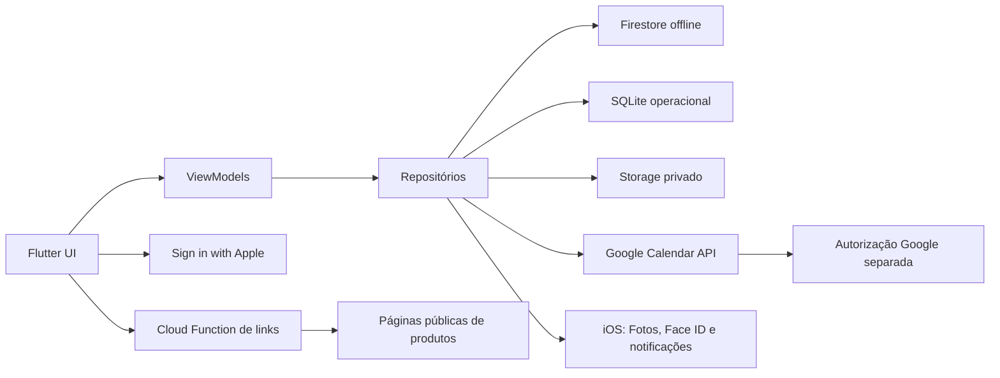

# Arquitetura técnica

## Objetivos

- Entregar primeiro no iPhone sem impedir Android no futuro.
- Manter ações cotidianas disponíveis offline.
- Isolar integrações externas do domínio do aplicativo.
- Facilitar testes por módulo e substituição de serviços.
- Evitar infraestrutura excessiva para uma única usuária.

## Stack proposta

| Camada | Escolha | Papel |
|---|---|---|
| Aplicativo | Flutter/Dart | Interface e lógica cliente |
| Design | Material 3 adaptado ao iOS | Componentes e tema |
| Estado/DI | Riverpod | Estado previsível e injeção de dependências |
| Navegação | GoRouter | Rotas, deep links e proteção de sessão |
| Identidade | Firebase Authentication + Apple | Conta da usuária |
| Dados | Cloud Firestore | Dados pessoais e sincronização offline |
| Arquivos | Firebase Storage | Fotos, capas e comprovantes futuros |
| Cache operacional | SQLite/Drift | Cache da Agenda, drafts e fila de uploads |
| Backend pontual | Cloud Functions | Extração de metadados, exportação e rotinas seguras |
| Agenda | Google Sign-In + Calendar API | Conta Google separada e eventos |
| Segredos locais | Keychain via secure storage | Tokens e preferências sensíveis |
| Notificações | API local do iOS via plugin Flutter | Lembretes no aparelho |
| Observabilidade | Crashlytics com redaction | Falhas técnicas sem conteúdo pessoal |

Não fixar versões de pacotes no plano. Elas serão selecionadas e travadas no `pubspec.lock` durante a fundação, após conferir compatibilidade com a versão Flutter adotada.

## Estrutura do aplicativo

Organização feature-first, com camadas internas:

```text
lib/
  app/
    bootstrap/
    navigation/
    theme/
  core/
    auth/
    errors/
    persistence/
    sync/
    time/
    widgets/
  features/
    today/
      data/
      domain/
      presentation/
    calendar/
    wellbeing/
      water/
      bowel/
      exercise/
    finance/
    shopping/
    books/
    gratitude/
    settings/
```

Cada feature contém:

- **presentation:** telas, widgets, view models/controllers e estado de UI;
- **domain:** entidades, regras e casos de uso quando agregarem clareza;
- **data:** repositórios, mapeadores e fontes Firebase/Google/dispositivo.

A UI não acessa Firebase ou Google diretamente. Repositórios formam a fronteira testável e a fonte de verdade para cada recurso.

As responsabilidades e APIs iniciais dos widgets em `core/widgets` estão documentadas em [Componentes compartilhados](13-componentes-compartilhados.md). As rotas, estados e eventos das telas estão em [Contratos das telas](12-contratos-telas.md).

## Fluxo de dependências

```text
Widget → ViewModel/Controller → Repository → Data source
                                      ├── Firestore/Storage
                                      ├── Google Calendar
                                      └── APIs do dispositivo
```

Modelos de API e documentos não atravessam a fronteira do repositório. Eles são convertidos para entidades de domínio.

## Visão de componentes



## Estratégia offline

### Dados próprios

Firestore será usado com persistência local habilitada no iPhone. Escritas aparecem na interface imediatamente e são enviadas quando a conexão retorna. Cada documento possui `createdAt`, `updatedAt`, `deviceId` e, quando necessário, `deletedAt`.

### Fotos

- Copiar a seleção para o diretório de suporte do app antes de depender dela.
- Criar o registro local antes do upload.
- Comprimir e remover metadados desnecessários no dispositivo.
- Exibir a cópia local imediatamente.
- Marcar `uploadState` como `pending`, `uploaded` ou `failed`.
- Repetir upload com backoff quando houver conexão.
- Nunca descartar o caminho local até confirmar upload.

### Google Agenda

Eventos recentes e `syncToken` ficam no cache operacional SQLite para leitura. No MVP, criação/edição exige conexão e preserva um rascunho se a chamada falhar. Uma fila persistente de mutações offline é uma melhoria posterior, pois sincronização bidirecional de recorrências e conflitos merece implementação própria.

Essa exceção deve ser comunicada sem bloquear os demais módulos.

## Sincronização e conflitos

- Dados de registro geralmente usam documentos imutáveis por ação; isso reduz conflitos.
- Edições simples seguem `last write wins`, exibindo `updatedAt`.
- Valor financeiro acumulado nunca é sincronizado como fonte de verdade: é calculado a partir dos lançamentos.
- Geração da mesada usa ID determinístico por usuário e competência, impedindo duplicação.
- Eventos Google usam `calendarId + eventId` como identidade externa.
- Exclusões sincronizáveis usam tombstone (`deletedAt`) antes da remoção física posterior.

## Ambientes

| Ambiente | Uso |
|---|---|
| local | Desenvolvimento, emuladores Firebase e mocks Google |
| dev | Testes em aparelho e build de desenvolvimento |
| prod | Distribuição privada e build de produção |

Dev e prod usam um único projeto Firebase para os dados próprios e um único projeto Google Cloud para a Agenda. O Firebase compartilhado informado é `lume-13125`, com Authentication, Firestore, Storage, Functions, App Check e Crashlytics; o Google Cloud compartilhado é `lume-app-506521` (“Lume App”), com Calendar API e OAuth. Não existe isolamento de dados entre os dois builds: um build dev pode ler e alterar os mesmos dados que o build prod. O modo `local` continua usando emuladores/mocks para evitar escrita acidental.

Neste projeto, dev e prod compartilham o mesmo bundle ID iOS por decisão explícita e apontam para os mesmos projetos Firebase e Google Cloud. A diferença entre builds fica restrita a flags, rótulo visual, logs técnicos e integrações locais; ela não é uma barreira de segurança. Isso impede instalação lado a lado e exige confirmação visual do ambiente antes de qualquer login, teste destrutivo ou migração.

## Configuração e segredos

- A configuração pública do Firebase pode ficar no arquivo gerado do projeto compartilhado; o modo `local` usa configuração de emulador.
- Segredos de backend ficam no Secret Manager/configuração segura de Functions.
- Tokens de acesso não entram em logs, Firestore ou controle de versão.
- Variáveis de build selecionam ambiente, nunca contêm chaves privadas.
- Arquivo `.env` não é a solução para segredos embutidos no aplicativo.

## Tempo, datas e moeda

- Persistir instantes em UTC e converter para o fuso da usuária.
- Persistir competência financeira como `YYYY-MM` independente de UTC.
- Usar um `Clock` injetável para testes de virada do dia/mês e horário de verão.
- Valores financeiros usam `int` em centavos e código ISO da moeda.
- Não usar `double` para dinheiro.

## Deep links e compartilhamento

- Definir URL scheme/universal link para retorno do OAuth quando necessário.
- A Share Extension nativa em `ios/ShareExtension` recebe URLs de Safari, TikTok e lojas pelo App Group `group.com.dodopok.lume`; o app valida novamente e abre o editor de desejos sem request direto.
- A extensão apenas valida/encaminha o link; a análise completa ocorre no app/backend.
- Suportar abertura direta das telas de favorito, livro e evento por rota interna.

## Notificações

- Agendar localmente metas e lembretes pessoais.
- Pedir permissão somente após a usuária ativar um lembrete.
- Conteúdo sensível fica oculto por padrão, por exemplo “Você tem um lembrete no Lume”.
- Reagendar após alteração de meta, fuso ou preferências.
- Não usar push remoto no MVP sem necessidade concreta.

## Biometria

- Face ID protege a abertura/retorno do app, não substitui autenticação da conta.
- Permitir intervalo curto antes de bloquear novamente.
- Prever fallback seguro para o código do aparelho, conforme política escolhida.
- Nunca apresentar tela sensível no app switcher; usar uma cobertura ao entrar em background.

## Desempenho

- Tela Hoje deve renderizar com dados locais antes de aguardar rede.
- Imagens usam thumbnails, cache e limites de dimensão.
- Listas históricas são paginadas.
- Consultas Firestore devem ser definidas com seus índices durante a implementação.
- Gráficos agregam apenas o período visível.

## Decisões que exigem spike técnico

1. Conexão Google dedicada que autorize os escopos da Agenda no iOS sem criar outra conta no app.
2. Teste em aparelho físico e assinatura da Share Extension interoperando com Flutter e App Groups; o target, canal e fluxo local já estão implementados.
3. Extração de Mercado Livre e TikTok Shop, com páginas reais fornecidas pela usuária.
4. Restauração de fotos pendentes após encerramento forçado do app.
5. Exportação completa e formato do arquivo entregue à usuária.
